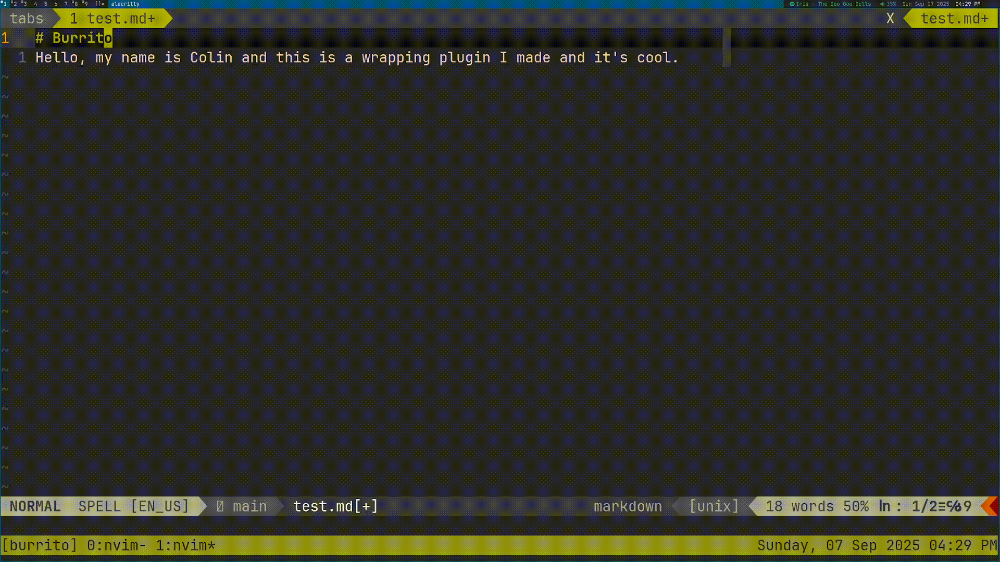

# 🌯 Burrito
Burrito is a Neovim plugin that makes text wrapping better. What sets Burrito
apart from settings like `:set wrap` or `:set col` is that when Burrito wraps,
it creates a new line rather than only graphically rendering a new line.
Additionally, Burrito is smart with Markdown syntax, and won't join lines that
shouldn't be joined. For example, two lines in a bullet list will be kept
separate.



## 📦 Installation
Default configuration, using Lazy:
```lua
return {
  "kolin63/burrito",

  config = function()
    require("burrito").setup({
      col = 80,                         -- The column to wrap text at

      file_types = { "*.md" },          -- What file types Burrito will check for

      -- lines that wrap with no other lines
      independent_patterns = {
        " {0,3}\\* *\\* *\\*",          -- Thematic Breaks
        " {0,3}- *- *-",                -- Thematic Breaks
        " {0,3}_ *_ *_",                -- Thematic Breaks
        " {0,3}-+ *$",                  -- Setext Heading Underline
        " {0,3}=+ *$",                  -- Setext Heading Underline
        " *$",                          -- All Whitespace
        " {0,3}`{3}",                   -- Fenced Code Block
        " {0,3}~{3}",                   -- Fenced Code Block
      },

      -- lines that wrap only with lines below
      bottom_only_patterns = {
        " {0,3}>",                      -- Block Quote
        " {0,3}[-+*] ",                 -- Bullet Lists
        " {0,3}[0123456789]{1,9}[.)] ", -- Ordered Lists
      },

      -- lines that don't wrap at all, not even if it reaches col 80
      no_wrap_patterns = {
        " {0,3}#{1,6} ",                -- ATX Headings
        " {4}",                         -- Indented Code Block
        "[|:]",                         -- Tables
      },

      -- lines that surround lines that don't wrap at all
      code_block_patterns = {
        " {0,3}`{3}",                   -- Fenced Code Block
        " {0,3}~{3}",                   -- Fenced Code Block
      },
    })
  end
}
```

## ⚙️ Configuration
If you are trying to add new regex patterns for different types of lines, there
are a few things to keep in mind.
### 📄 Types of Lines
* **Independent Lines** don't join with lines above or below.
* **Bottom Only Lines** don't join with lines above, but do with lines below.
* **No Wrap Lines** are like independent lines, but don't wrap even if the
  column limit is reached
  * **Code Block Lines** denote a range of no wrap lines. Keep in mind that if
    you want the actual code block symbols to be independent, they must be
    defined again in the independent patterns list.
### 💻 Regex
Since Lua does not ship with Regex searching, Burrito implements its own
Regex-like system. However, it is not a complete implementation. Here is what
it includes:
* Every line is parsed as if it started with a ^
* $ for end of line
* {x} for amount of matches
* {x,y} for range of matches
* [xyz] for multiple characters
* \* for 0 or more of
* \+ for 1 or more of
* \ as an escape character
